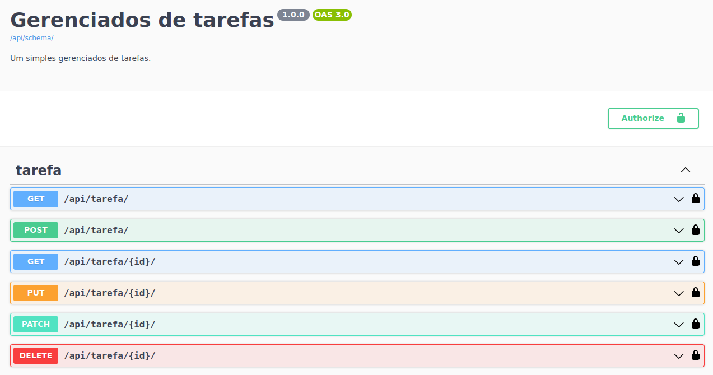

# task-manager-api-challenge-by-spacelaxy
task manager api challenge by spacelaxy

### COM DOCKER
apenas rodar o comando abaixo:

`docker build -t task-project .`

`docker run --rm --name task-container --publish 8000:8000 task-project`

### SEM DOCKER > Criando ambiente virtual

``python -m venv .venv``

 ### Ativando ambiente virtual

 #### linux

``source .venv/bin/activate``

#### windows

``.venv\Scripts\Activate ``

#### Instalando dependências

`` pip install -r requirements.txt``

#### aplicando migrações e rodando projeto

``python manage.py migrate``

``python manage.py runserver``

#### rodando testes

`` pytest ``

#### documentação

http://localhost:8000/api/schema/swagger-ui/
http://localhost:8000/api/schema/redoc/

